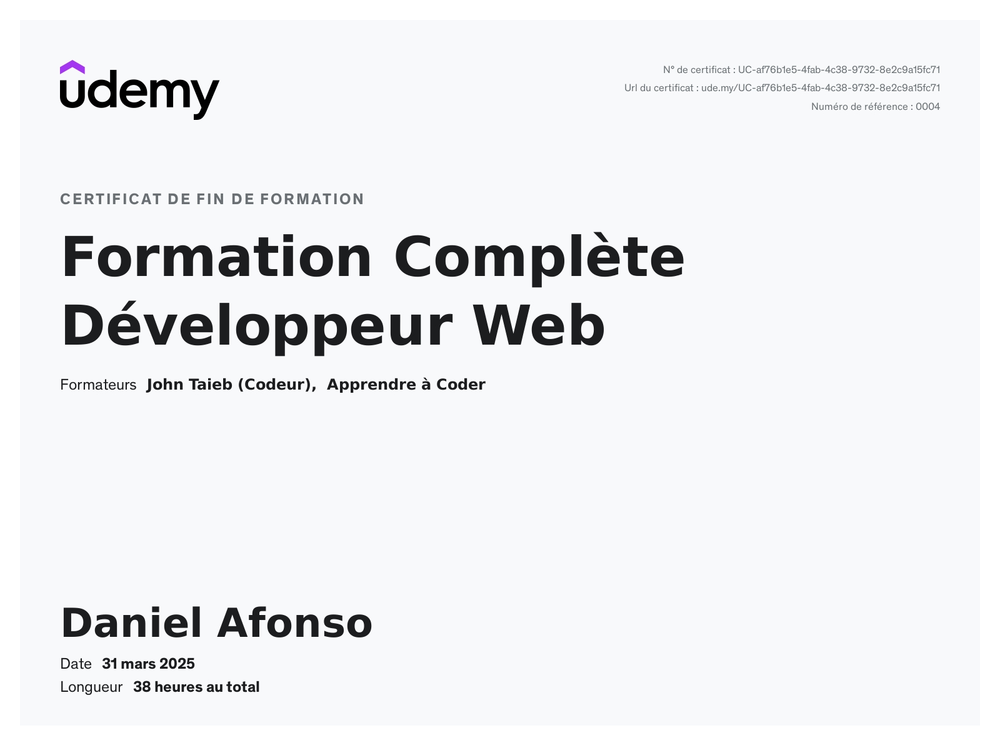
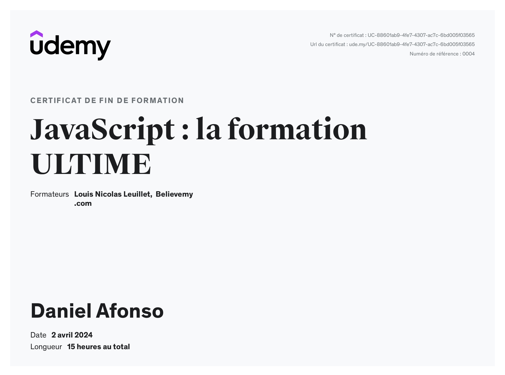
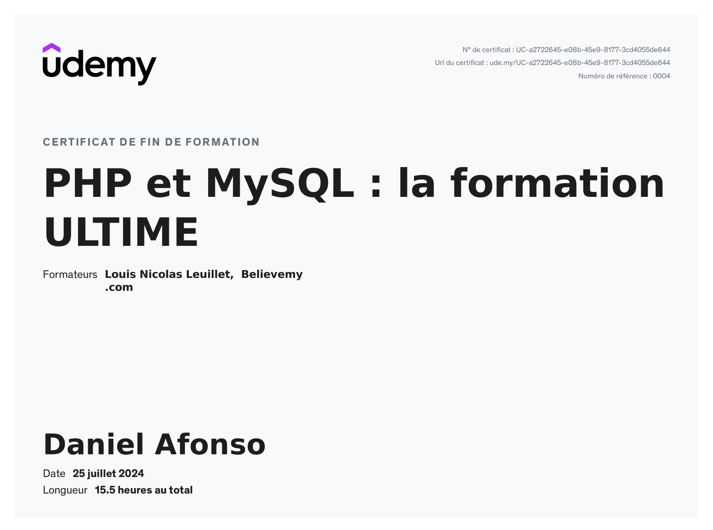

## 👋 Hi, I'm Daniel  
### 🎓 Student at 42 Lausanne, Switzerland  
### 🌱 Currently learning **React** and **C++**  
### 💡 Passionate about **Basketball** 🏀 and **Chess** ♟️

---

## 📈 GitHub Stats

  
  

---

  

## 🛠️ Languages & Tools

### 💻 Programming Languages
#### - **HTML5, CSS3, JavaScript, PHP, C, C++, C#**

### ⚡ Frameworks & Libraries
#### - **Bootstrap5, React (in progress...)**

### 🔧 Tools & Environments
#### - **Git, Linux, Unity, Visual Studio Code, Visual Studio, WordPress**

---

## 🎓 Certificates

  
  
  

---

## 📊 GitHub Activity

---

## 🎯 Hobbies
- 🏀 Basketball: 10 years of experience (3rd Swiss division)  
- ♟️ Chess enthusiast  

---

## 📫 Connect with me
  

